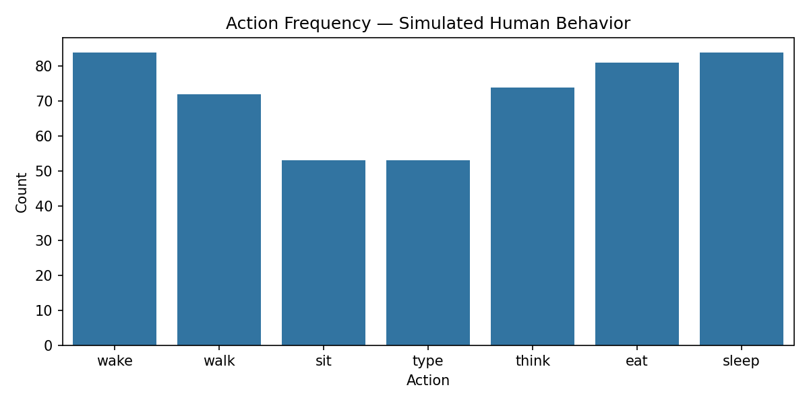
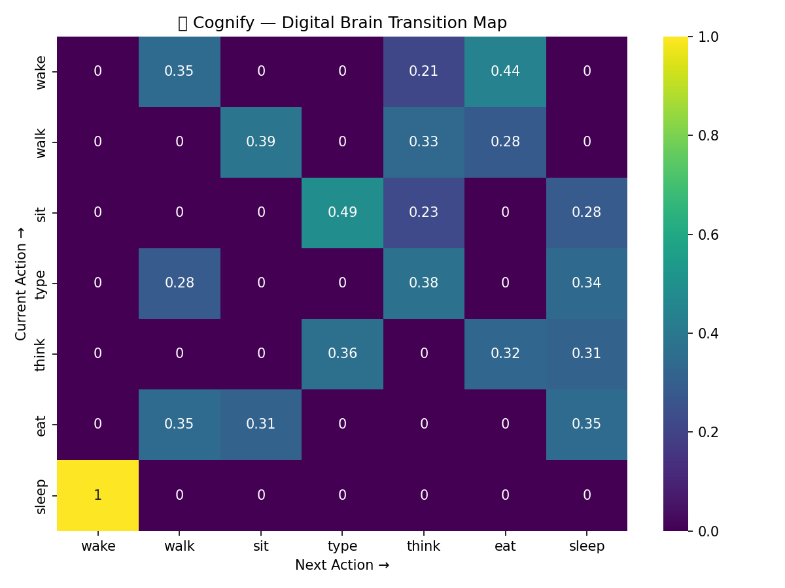

# 🧠 Project Cognify — The Digital Brain Twin

> “The brain doesn’t just react — it predicts.”  
> *Project Cognify* is a digital simulation of that very idea.

---

## 🧬 Overview
**Cognify** is a *Digital Brain Twin* — a simplified computational model that learns from behavior and predicts what will happen next.  

It’s inspired by **Predictive Coding** and **Bayesian Brain Theory**, which describe how our brain constantly forms expectations about the world and updates them when it’s wrong.  

In simple terms:  
🧩 Cognify tries to **think ahead**, like the human brain does.

---

## 🎮 How It Works
1. **Behavior Simulation**  
   A sequence of human-like actions is generated — walking, eating, sleeping, thinking, etc.  
   The digital brain observes and learns from these sequences.  
    
   

2. **Brain Learning**  
   The system learns *how one action leads to another* — forming a neural transition model.  
   It begins to understand that “thinking” often leads to “typing” or “sleeping.”  
    
   

3. **Neural Drift (Animation)**  
   Watch the brain evolve in real time as it learns new transitions —  
   like synapses strengthening with experience.  
    
   

---

## 🧠 Scientific Inspiration
This project brings to life the **Predictive Brain Hypothesis**, one of the most exciting ideas in modern neuroscience.

> The brain is a prediction machine — constantly comparing what it expects with what it perceives.

Every time Cognify guesses wrong, it adjusts its internal model —  
just like your brain refines its expectations with experience.

---

## 🧩 Technical Details
- **Language:** Python  
- **Libraries:** NumPy, Matplotlib, Seaborn, tqdm  
- **Model:** Markov Transition Matrix (simulated Bayesian network)  
- **Outputs:**  
  - Behavior sequence CSV  
  - Transition heatmap  
  - Animated neural learning GIF  

---

## ☁️ Run It Yourself (Colab)
You can open and run Cognify directly in Google Colab:  

---

## ✨ Why It Stands Out
Most AI projects only *classify* things.  
**Cognify** goes further — it *predicts* and *visualizes thought*.  

It’s not just a model; it’s a metaphor for intelligence itself.  
Your AOs won’t just see code — they’ll *see cognition.*

---

## 🔬 Creator
**Devansh [Your Last Name]**  
*Aspired neuroscientist exploring the interface of cognition and computation.*

---

🧠 *“Cognition is not the processing of information — it is the anticipation of it.”*
